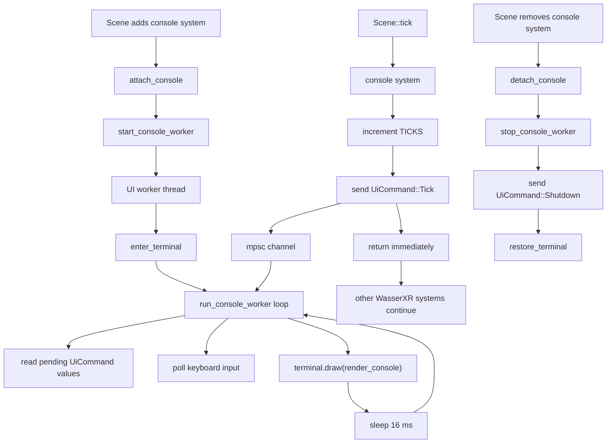

# WasserXR Console System

This document explains `src/console/mod.rs` as an educational Ratatui example.
The important idea is simple:

> WasserXR systems should finish quickly. The console system sends data to a UI
> worker thread, then returns so the next systems can run.

Ratatui is only used inside that worker thread.

## Big Picture



## Ratatui In This File

Ratatui is a terminal UI library. It does not create a normal desktop window.
It draws text-based widgets into the terminal.

The basic Ratatui model is:

1. Keep your application state in normal Rust structs.
2. On every frame, build widgets from that state.
3. Ask Ratatui to draw those widgets into terminal areas.
4. Repeat.

That is called an immediate-mode UI. The UI is recreated from `UiState` every
frame. Ratatui does not own the console input text or submitted text; this file
owns that data in `UiState`.

This file also uses Crossterm. Crossterm is the lower-level terminal backend:
it enters raw mode, switches to the alternate screen, hides the cursor, reads
keyboard events, and restores the terminal when the worker exits.

The Ratatui pieces used here are:

- `Terminal`: owns the drawing backend and starts each draw.
- `CrosstermBackend`: tells Ratatui to draw through Crossterm.
- `Frame`: the temporary drawing surface passed into `render_console`.
- `Layout`: splits the terminal into rectangular chunks.
- `Paragraph`: a widget for text.
- `Block` and `Borders`: boxes around widgets.
- `Line` and `Span`: styled pieces of text.
- `Style` and `Color`: terminal colors.

## The Data Types

### `UiCommand`

```rust
enum UiCommand {
    Tick(u64),
    Shutdown,
}
```

`UiCommand` is the message type sent from WasserXR code to the UI worker.

- `Tick(u64)` means "the system ran; display this tick number."
- `Shutdown` means "restore the terminal and exit the worker thread."

This keeps the thread boundary boring. The system does not call Ratatui
directly. It only sends one enum value.

### `ConsoleWorker`

```rust
struct ConsoleWorker {
    command_tx: Sender<UiCommand>,
    handle: Option<JoinHandle<()>>,
}
```

`ConsoleWorker` stores the two things the main thread needs to manage the UI
thread:

- `command_tx` sends commands to the worker.
- `handle` lets `stop_console_worker` join the thread during cleanup.

There is one global worker slot:

```rust
static CONSOLE_WORKER: LazyLock<Mutex<Option<ConsoleWorker>>> = ...
```

The `Mutex` makes access safe from multiple callers. The `Option` means "worker
is running" or "worker is not running."

### `UiState`

```rust
struct UiState {
    tick: u64,
    input: String,
    submitted: String,
    last_key: String,
}
```

`UiState` is the data Ratatui renders.

- `tick`: latest WasserXR system tick received from the channel.
- `input`: text currently being typed.
- `submitted`: last text submitted with Enter.
- `last_key`: readable name of the last key press.

This state lives inside the worker thread. That is why typing in the UI does not
need to mutate WasserXR ECS data.

## The WasserXR Lifecycle

### `console`

```rust
#[system]
pub fn console(_scene: &mut Scene, _entities: Vec<Vec<Uuid>>) {
    let tick = TICKS.fetch_add(1, Ordering::Relaxed).saturating_add(1);
    send_tick(tick);
}
```

This is the actual WasserXR system. It intentionally does almost nothing:

1. Increment the global `TICKS` counter.
2. Send the new tick to the UI worker.
3. Return.

There is no Ratatui drawing here. There is no keyboard polling here. There is no
sleep here. That is the reason this system does not hold up other systems.

The `_scene` and `_entities` parameters are still present because that is the
shape WasserXR systems use. The underscore says this example does not need
those values.

### `attach_console`

```rust
#[attacher(console)]
pub fn attach_console(_scene: &mut Scene) {
    start_console_worker();
}
```

The attacher runs when the system is added to the scene. This starts the worker
once, before normal ticks begin.

Starting the terminal here keeps `console` small. The per-frame system path only
sends data.

### `detach_console`

```rust
#[detacher(console)]
pub fn detach_console(_scene: &mut Scene) {
    stop_console_worker();
}
```

The detacher runs when the system is removed. It sends `Shutdown` and waits for
the worker to exit.

Joining the thread here is fine because it is lifecycle cleanup. It is not done
inside the per-tick system.

## Starting And Stopping The Worker

### `start_console_worker`

`start_console_worker` protects the global worker slot with a mutex.

It does three jobs:

1. If a live worker already exists, return.
2. If an old finished worker exists, join it and remove it.
3. Create a channel and spawn `run_console_worker`.

The channel is created with:

```rust
let (command_tx, command_rx) = mpsc::channel();
```

The main thread keeps `command_tx`. The worker thread receives `command_rx`.

### `stop_console_worker`

`stop_console_worker` removes the worker from the global slot, sends
`UiCommand::Shutdown`, then joins the worker thread.

That gives the worker a chance to call `restore_terminal`. Without that cleanup,
the terminal could stay in raw mode or alternate-screen mode.

### `send_tick`

`send_tick` locks the worker slot, finds the sender, and sends
`UiCommand::Tick(tick)`.

If sending fails, the receiver is gone. In that case the global worker slot is
cleared. The function does not try to draw or repair the UI from the system
thread.

## The Worker Loop

### `run_console_worker`

`run_console_worker` owns the terminal UI.

Its loop is:

1. Read all pending `UiCommand` messages with `try_iter`.
2. Poll keyboard input.
3. Draw the whole UI with Ratatui.
4. Sleep for about one frame.

The command handling looks like this:

```rust
match command {
    UiCommand::Tick(tick) => state.tick = tick,
    UiCommand::Shutdown => {
        restore_terminal(terminal);
        return;
    }
}
```

That is the bridge between WasserXR and Ratatui. WasserXR sends ticks. The UI
worker stores the latest tick in `UiState`.

The worker uses `try_iter` so it drains whatever messages are ready without
blocking. If there are no messages, it still handles input and redraws.

## Terminal Setup And Cleanup

### `enter_terminal`

`enter_terminal` prepares the terminal for a full-screen text UI:

1. `enable_raw_mode()` makes key presses available directly.
2. `EnterAlternateScreen` switches to a separate full-screen terminal buffer.
3. `Hide` hides the cursor.
4. `Terminal::new(CrosstermBackend::new(stdout))` creates the Ratatui terminal.

If setup fails after raw mode is enabled, the function disables raw mode again.
That is small but important cleanup.

### `restore_terminal`

`restore_terminal` undoes setup:

1. Show the cursor.
2. Leave the alternate screen.
3. Disable raw mode.
4. Ask Ratatui to show the cursor too.

Terminal UI code should always have a cleanup path like this.

## Keyboard Input

### `poll_input`

`poll_input` checks for keyboard events:

```rust
while matches!(event::poll(Duration::from_millis(1)), Ok(true)) {
    let Ok(Event::Key(key)) = event::read() else {
        continue;
    };

    handle_key(key, state);
}
```

The short poll timeout keeps the UI responsive without blocking the worker for
long. This code runs in the worker thread, so even if input handling takes a
moment, WasserXR systems are not held.

### `handle_key`

`handle_key` mutates `UiState` based on the key:

- normal characters append to `input`.
- Backspace removes one character.
- Enter copies `input` into `submitted` and clears `input`.
- `q`, Esc, and Ctrl-C set `submitted` to `"close requested"`.

In this minimal example, `q` does not stop the worker by itself. Shutdown is
owned by `detach_console`.

### `describe_key`

`describe_key` turns a `KeyEvent` into text for display. For example:

- `a` becomes `"a"`.
- Ctrl-C becomes something like `"CONTROL+c"`.
- special keys use Rust debug formatting, such as `"Esc"`.

## Rendering With Ratatui

### `render_console`

`render_console` receives a `Frame` from Ratatui and the current `UiState`.
It does not read input. It does not change state. It only renders.

First, the screen is split into four vertical chunks:

```rust
let chunks = Layout::default()
    .direction(Direction::Vertical)
    .constraints([
        Constraint::Length(3),
        Constraint::Length(3),
        Constraint::Length(3),
        Constraint::Min(1),
    ])
    .split(frame.area());
```

That means:

- chunk 0 is 3 rows tall for tick and last key.
- chunk 1 is 3 rows tall for current input.
- chunk 2 is 3 rows tall for submitted input.
- chunk 3 gets the remaining space for help text.

Then each chunk gets a `Paragraph`.

Example:

```rust
Paragraph::new(Line::from(vec![
    Span::styled("Tick: ", Style::default().fg(Color::Cyan)),
    Span::raw(state.tick.to_string()),
]))
```

A `Paragraph` is the widget. A `Line` is one row of text. A `Span` is one piece
of that row. Some spans are styled, and some are raw.

Finally, `frame.render_widget(widget, area)` draws each widget into its chunk.

## Why This Does Not Block Other Systems

The blocking or slow operations are all in the worker thread:

- terminal setup
- terminal drawing
- keyboard polling
- sleeping between frames

The WasserXR system path only does:

1. atomic counter increment
2. channel send
3. return

That is the main lesson of this example. Ratatui can be used from a WasserXR
system, but the terminal UI loop should not be the system body.

## Current Simplifications

This is intentionally a small teaching example.

- There is only one global console worker.
- The UI state is local to the worker, not stored in ECS components.
- `q`, Esc, and Ctrl-C only display `"close requested"`.
- The channel is the standard library `mpsc` channel.
- Errors during drawing and cleanup are ignored.

Those choices keep the example focused: how to run Ratatui beside WasserXR
without making the system execution wait for the UI.
